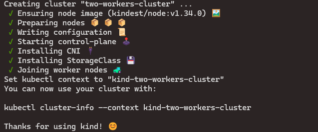

# Experiment K8s External Secrets

This project will try to documernt with examples how to implement and the CRD secret external easily. 


## Structure of Components

        ├── chart-test-secret-external
        │   ├── charts
        │   ├── Chart.yaml
        │   ├── templates
        │   │   ├── deployment.yaml
        │   │   ├── _helpers.tpl
        │   │   ├── hpa.yaml
        │   │   ├── httproute.yaml
        │   │   ├── ingress.yaml
        │   │   ├── NOTES.txt
        │   │   ├── serviceaccount.yaml
        │   │   ├── service.yaml
        │   │   └── tests
        │   │       └── test-connection.yaml
        │   └── values.yaml
        ├── kind-cluster-conf
        ├── README.md
        └── simple-project
            ├── Dockerfile
            ├── go.mod
            └── main.go


### Simple project to verify the secrets


### Start the cluster of k8s

Using the next command

```bash
kind create cluster --config kind-config.yaml
```

Ther next image show you the result to create the cluster 



If the execution completed successfully, you should have a small k8s cluster running with 2 workers and a control plane.